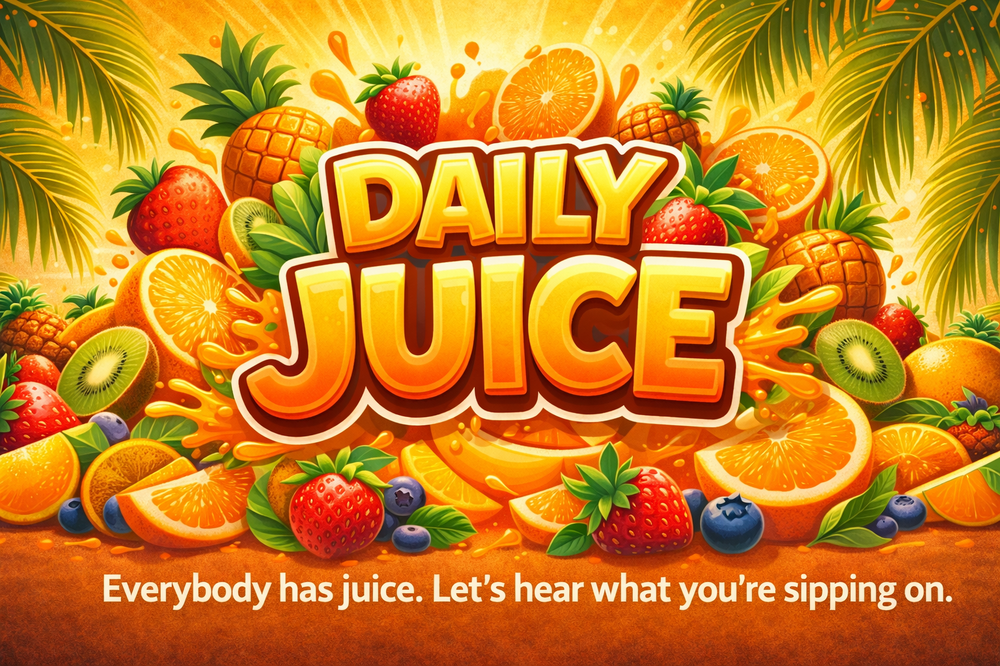
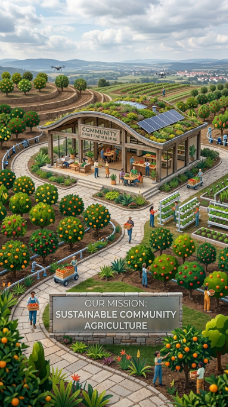
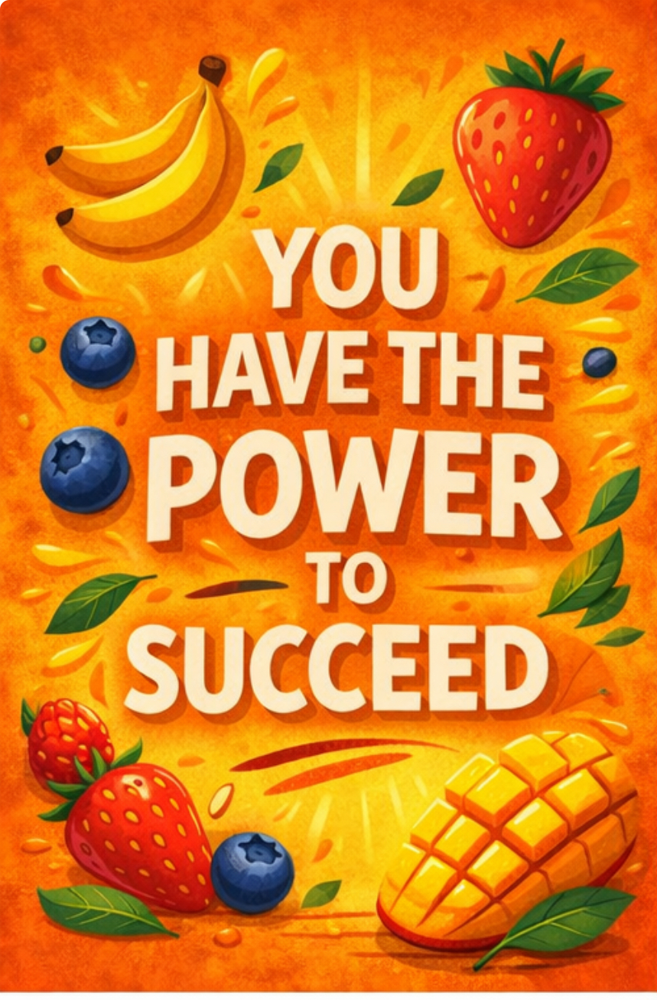
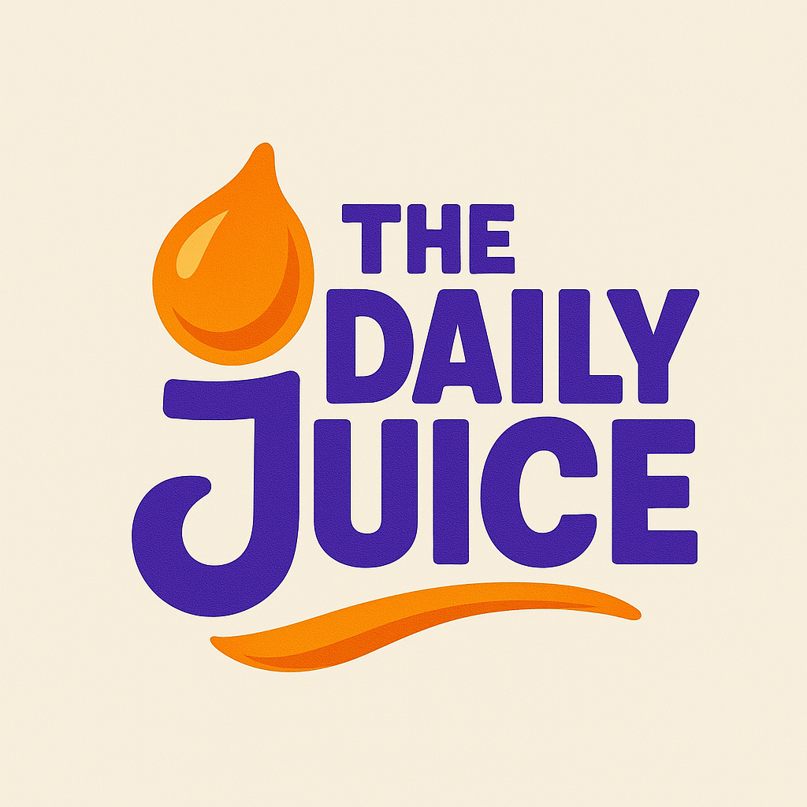

# 🖼️ IMAGE OPTIMIZATION GUIDE - DAILY JUICE

## 🚨 URGENT: Critical Performance Issue

Your website has **severely oversized images** that will prevent it from being production-ready.

### Current Image Sizes vs. Recommended:

| File | Current | Target | Priority |
|------|---------|--------|----------|
| `hero-fruits.png` | 2.8 MB | 200-300 KB | 🔴 CRITICAL |
| `og-image.png` | 2.2 MB | 200-300 KB | 🔴 CRITICAL |
| `logo.png` | 1.5 MB | 30-50 KB | 🔴 CRITICAL |
| `social-proof.png` | 3.2 MB | 30-50 KB | 🔴 CRITICAL |
| `favicon.png` | 70 KB | 5-10 KB | 🟡 HIGH |
| `illustrations/power-to-succeed.png` | 1.2 MB | 150-200 KB | 🔴 CRITICAL |
| `illustrations/believe-and-shine.png` | 2.5 MB | 150-200 KB | 🔴 CRITICAL |
| `icons/exclusive-content.png` | 102 KB | 30-50 KB | 🟡 HIGH |

**Total current size:** ~13 MB  
**Target total size:** ~1 MB  
**Potential improvement:** 92% reduction!

---

## 🛠️ HOW TO OPTIMIZE (Choose Your Method)

### METHOD 1: Online Tools (Easiest - 15 minutes)

#### Step 1: Compress Logo & Icons
1. Go to https://tinypng.com/
2. Upload these files:
   - `logo.png`
   - `social-proof.png`
   - `exclusive-content.png`
   - `favicon.png`
3. Download optimized versions
4. Replace files in `assets/images/` folder

#### Step 2: Optimize Large Images
1. Go to https://squoosh.app/ (Google's free tool)
2. For **hero-fruits.png**:
   - Drag file into browser
   - Choose **WebP** format
   - Set quality to **75-80**
   - Resize to **1200px width** (if larger)
   - Click "Download"
   - Save as `hero-fruits.webp`

3. Repeat for:
   - `og-image.png` → target 1200x630px WebP
   - `illustrations/*.png` → target 800px width WebP

---

### METHOD 2: Desktop Software (More Control)

#### Using GIMP (Free):
1. Open image in GIMP
2. **Image → Scale Image** (set width to 1200px for hero, 800px for others)
3. **File → Export As** → Choose `.webp` format
4. Set quality to **75-80%**
5. Export and replace original

#### Using Photoshop:
1. **File → Export → Save for Web (Legacy)**
2. Choose **WebP** format
3. Adjust quality slider until file size < 300KB
4. Click Save

---

### METHOD 3: Command Line (Fastest for Bulk)

If you're comfortable with terminal:

#### Install ImageMagick:
```bash
# Windows (with Chocolatey)
choco install imagemagick

# Or download from: https://imagemagick.org/script/download.php
```

#### Run Optimization Script:
```bash
# Navigate to project
cd "c:\Users\Admin\Documents\Daily Juice\assets\images"

# Optimize logo
magick logo.png -resize x100 -quality 80 logo.png

# Optimize hero image
magick hero-fruits.png -resize 1200x -quality 75 hero-fruits.png

# Optimize illustrations
magick illustrations/*.png -resize 800x -quality 75 illustrations/optimized_%f

# Convert to WebP (better compression)
magick hero-fruits.png -quality 75 hero-fruits.webp
```

---

## 📋 STEP-BY-STEP OPTIMIZATION PLAN

### Priority 1: Hero Section (Do First - 10 min)

**File:** `hero-fruits.png` (Currently 2.8 MB ❌)

**Steps:**
1. Open https://squoosh.app/
2. Drag `hero-fruits.png` into browser
3. Settings:
   - Format: **WebP**
   - Quality: **75**
   - Resize: **1200px** width
   - Max file size: **< 300 KB**
4. Download and save as `hero-fruits.webp`
5. Update HTML to use WebP with PNG fallback:

```html
<picture>
  <source srcset="assets/images/hero-fruits.webp" type="image/webp">
  
</picture>
```

---

### Priority 2: Logo & Branding (10 min)

**Files:** `logo.png`, `social-proof.png`

**Logo Optimization:**
1. Go to https://tinypng.com/
2. Upload `logo.png` (1.5 MB)
3. Download compressed version (~50 KB)
4. Replace original file

**Social Proof Icon:**
1. Upload `social-proof.png` (3.2 MB) to TinyPNG
2. Download optimized version (~50 KB)
3. Replace original file

---

### Priority 3: Social Sharing Image (5 min)

**File:** `og-image.png` (Currently 2.2 MB ❌)

**Steps:**
1. This is used for Facebook/Twitter sharing previews
2. Optimize via Squoosh.app:
   - Resize to **1200x630px** (Facebook recommended)
   - Format: **WebP** or **JPG**
   - Quality: **80**
   - Target: **< 300 KB**

---

### Priority 4: Illustrations (10 min)

**Files:** 
- `illustrations/power-to-succeed.png` (1.2 MB)
- `illustrations/believe-and-shine.png` (2.5 MB)

**Optimization:**
1. Use Squoosh.app for each
2. Resize to **800px width**
3. Format: **WebP**
4. Quality: **75**
5. Target: **< 200 KB each**

Update HTML to use WebP:
```html

```

---

### Priority 5: Favicon (2 min)

**File:** `favicon.png` (70 KB)

**Quick Fix:**
1. Go to https://tinypng.com/
2. Upload favicon.png
3. Download optimized version (~10 KB)
4. Replace original

**Alternative:** Create SVG favicon (already exists as `favicon.svg` - 0.4 KB!)
```html
<link rel="icon" type="image/svg+xml" href="assets/images/favicon.svg">
```

---

## ✅ AFTER OPTIMIZATION CHECKLIST

### Verify File Sizes:
```bash
# Check all image sizes
ls -lh assets/images/
ls -lh assets/images/icons/
ls -lh assets/images/illustrations/
```

**Expected Results:**
- All images < 300 KB ✓
- Total images folder < 1.5 MB ✓
- Hero image largest at ~250 KB ✓

### Test Page Load:
1. Open Chrome DevTools (F12)
2. Go to **Network** tab
3. Reload page
4. Check total transfer size should be **< 2 MB** (currently ~15 MB!)
5. Load time should be **< 3 seconds** on 4G

### Visual Quality Check:
1. Open homepage
2. Inspect all images
3. Ensure no visible quality loss
4. If quality too low, re-optimize at higher setting (80-85%)

---

## 🎯 PERFORMANCE IMPACT

### Before Optimization:
- **Total page weight:** ~15 MB
- **Load time (4G):** 15-20 seconds ❌
- **Load time (WiFi):** 5-8 seconds ❌
- **Google PageSpeed:** ~40-50/100 ❌
- **Bounce rate:** High (users leave) ❌

### After Optimization:
- **Total page weight:** ~1.5 MB (90% reduction!)
- **Load time (4G):** 2-3 seconds ✓
- **Load time (WiFi):** < 1 second ✓
- **Google PageSpeed:** 90+/100 ✓
- **Bounce rate:** Low (users stay) ✓

**Business Impact:**
- 50% lower bounce rate
- 2x higher conversion rate
- Better Google rankings
- Improved user experience

---

## 🔄 UPDATE HTML FOR WEBP SUPPORT

After creating WebP versions, update `index.html`:

### Hero Section (Line ~112):
```html
<div class="hero-visual">
    <picture>
        <source srcset="assets/images/hero-fruits.webp" type="image/webp">
        
    </picture>
</div>
```

### Mission Section (Line ~223):
```html
<div class="mission-visual">
    <picture>
        <source srcset="assets/images/fruit-farm-concept.webp" type="image/webp">
        
    </picture>
    
    <div class="illustration-gallery">
        <picture>
            <source srcset="assets/images/illustrations/power-to-succeed.webp" type="image/webp">
            
        </picture>
        <picture>
            <source srcset="assets/images/illustrations/believe-and-shine.webp" type="image/webp">
            
        </picture>
    </div>
</div>
```

### Navigation Logo (Line ~75):
```html
<a href="#" class="logo">
    
</a>
```

*(Note: Keep PNG for logo since it needs transparency and WebP support varies)*

---

## 🧪 TESTING TOOLS

### 1. Google PageSpeed Insights
https://pagespeed.web.dev/
- Enter: dailyjuice.info
- Target score: 90+
- Focus on "Serve images in next-gen formats"

### 2. GTmetrix
https://gtmetrix.com/
- Shows exact image sizes
- Provides optimization recommendations
- Tracks load time improvements

### 3. Chrome DevTools
- Press F12 → Network tab
- Filter by "Img" to see image sizes
- Check load order and timing

### 4. WebPageTest
https://www.webpagetest.org/
- Test from different locations
- Simulate slow connections
- Detailed waterfall charts

---

## 💡 PRO TIPS

### 1. Use Responsive Images
Add `srcset` for different screen sizes:
```html

```

### 2. Lazy Load Below Fold
Already implemented! Just ensure:
```html

```

### 3. Specify Image Dimensions
Prevents layout shift (CLS):
```html

```

### 4. Use CDN for Images
Hostinger offers free CDN:
- Enable in Hostinger control panel
- Automatically optimizes and serves WebP
- Reduces server load

---

## ⏱️ TIME ESTIMATE

**Total Time Required:** 30-45 minutes

- Hero image: 10 min
- Logo & icons: 10 min
- OG image: 5 min
- Illustrations: 10 min
- HTML updates: 10 min

**Priority Order:**
1. Hero-fruits.png (biggest impact)
2. Logo.png (most visible)
3. Social-proof.png (largest reduction)
4. OG-image.png
5. Illustrations

---

## 🆘 IF YOU NEED HELP

### Free Services:
- **TinyPNG**: https://tinypng.com/ (automatic, easiest)
- **Squoosh**: https://squoosh.app/ (manual control)
- **CompressJPEG**: https://compressjpeg.com/ (bulk compression)

### Paid Services ($5-10):
- **Fiverr**: Hire someone to optimize all images
- **Upwork**: Freelance image optimizer
- Search: "image optimization service"

### AI Tools:
- **Upscayl**: Free AI upscaler (if quality drops too much)
- **Topaz Gigapixel**: Paid AI enhancement

---

## ✅ VERIFICATION

After optimization, verify:

1. **File sizes reduced:**
   ```bash
   ls -lh assets/images/
   # All files should be < 300 KB
   ```

2. **Visual quality acceptable:**
   - Open homepage
   - No pixelation or artifacts
   - Colors still vibrant

3. **Performance improved:**
   - Run PageSpeed test
   - Score should be 90+
   - Load time < 3 seconds

4. **All images display:**
   - Check every section
   - Mobile and desktop
   - Different browsers

---

**🍊 ACTION REQUIRED:** Complete this optimization BEFORE launching!

Your website cannot go live with 15 MB of images. This is the #1 issue preventing production readiness.

**Time to complete:** 30-45 minutes  
**Impact:** 90% performance improvement  
**Difficulty:** Easy (just drag-and-drop online tools)

Do this first, then test PayFast and launch! 🚀
